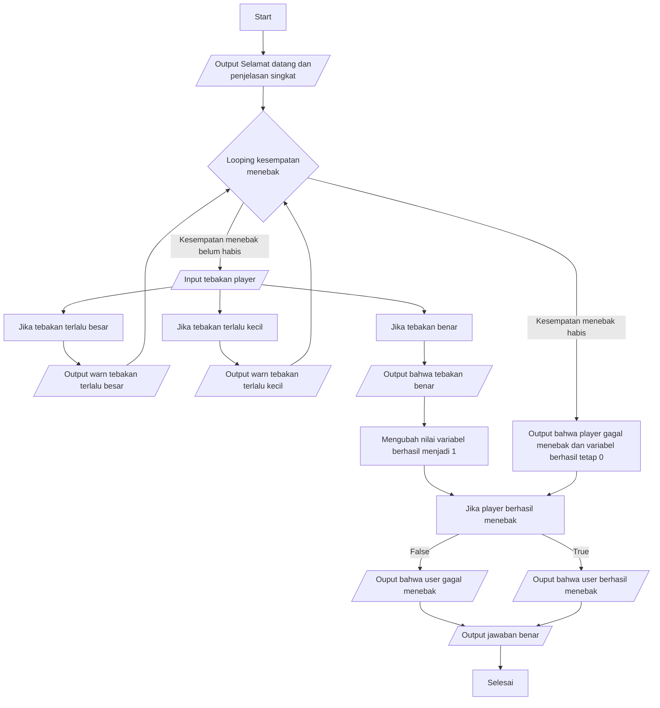

# 🔢 Guess Number Game

Sebuah game tebak angka sederhana yang berbasis CLI yang mengimplementasikan library random di python.

## ✨ Fitur Fitur
* **Angka Random:** Setiap kali game dimulai akan selalu menggunakan baru yang random.
* **Kesempatan Menebak:** User mendapatkan kesempatan sebanyak 7 kali untuk menebak angka.
* **Error Handling:** User akan dimintai jawaban ulang jika user memasukan jawaban selain angka.

## 🛠️ Dibuat Dengan
|  Komponen  |  Teknologi  |
| ---------- | ----------- |
| **Bahasa** | Python 3.x|
| **Library** | Random |
| **Tools** | VsCode, Git |

## 🚀 Cara Menjalankan
1. Pastikan Python dan VSCode sudah terinstall.
2. Clone Repository ini:
```bash
git clone https://github.com/IMurai/guess-number-game.git
```
3. Ketikan pada terminal untuk menjalankan:
```
python ./src/guess-number-game.py
```

## 💡 Cara Kerja


## 📚Apa yang saya pelajari
1. Pengunaan library random sebagai penentu angka tebakan
2. Implementasi try-except sebagai error handling jika user memasukan jawaban selain angka 

## 📌 Note
* Program ini masih tahap dasar dan dapat dikembangkan di masa mendatang.
* Data yang diinput akan hilang setelah program ditutup (tidak ada tempat penyimpanan input permanen).

## 📄 Lisensi
Project ini bebas digunakan untuk keperluan belajar. 

## 📧 Kontak & Feedback
Jika Anda memiliki saran atau feedback tentang project ini, silakan hubungi melalui:
| Platform | Tautan |
| :--- | :--- |
| **Email** | *raihaan.tech@proton.me* |
| **GitHub** | [@IMurai](https://github.com/IMurai) |
| **Instagram** | [murai.brok](https://www.instagram.com/murai.brok/) |